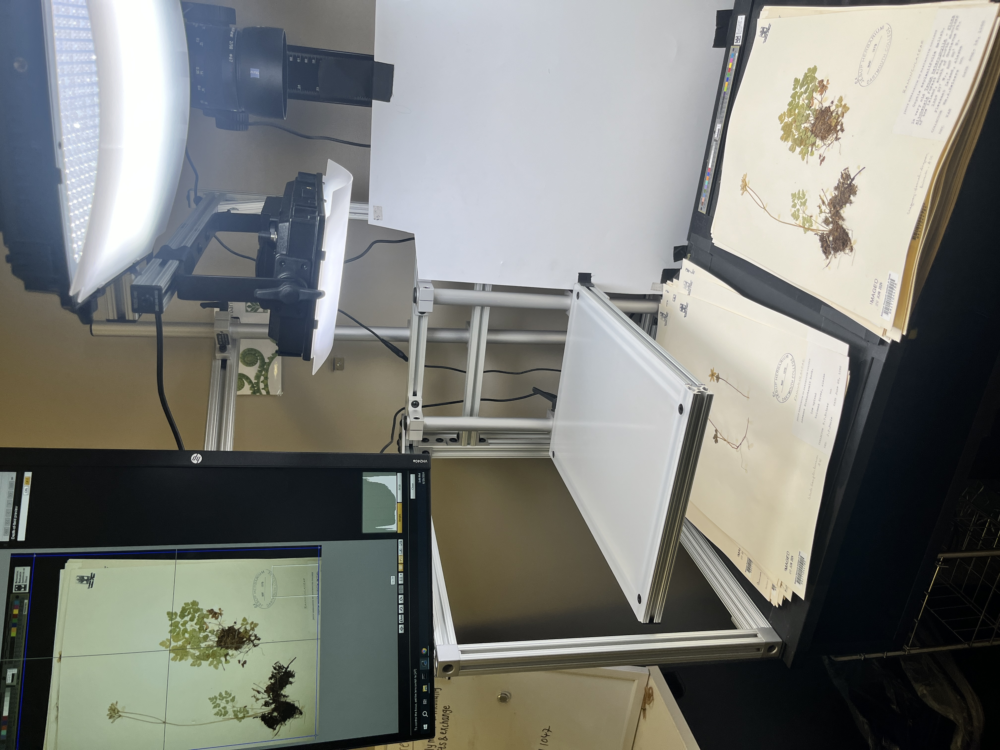
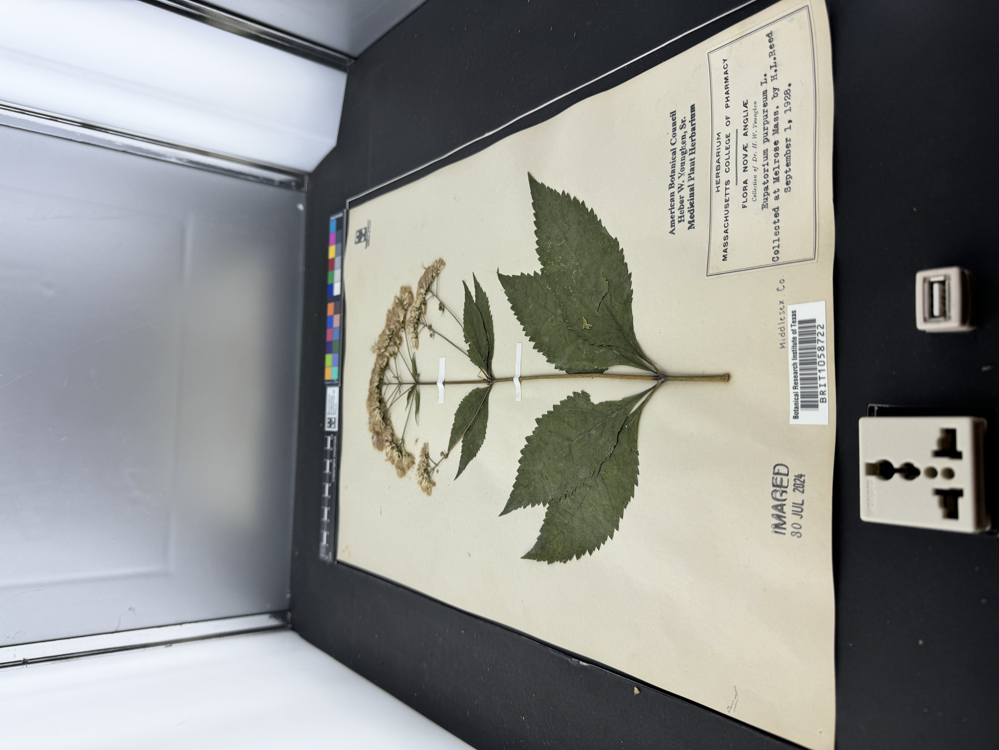
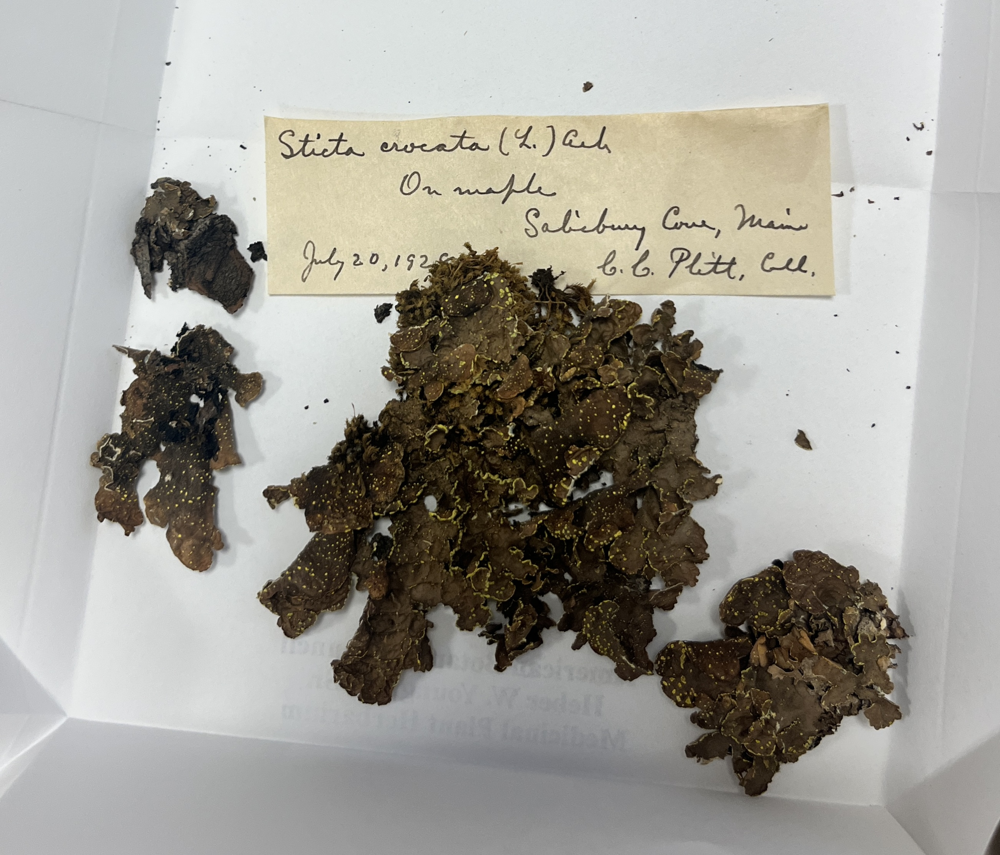
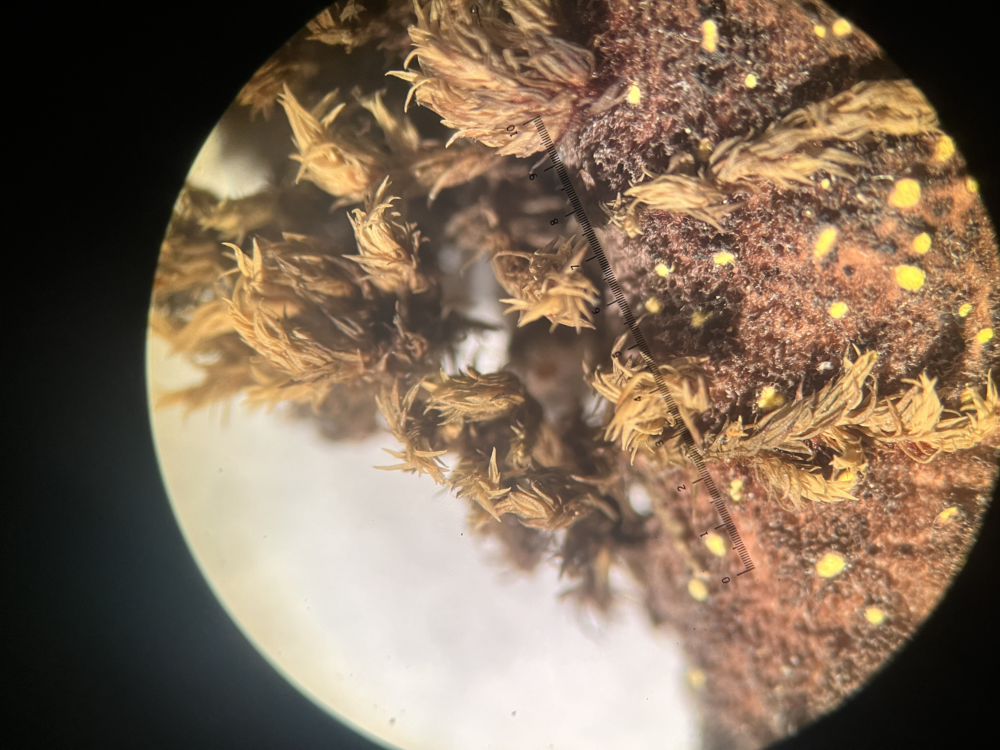
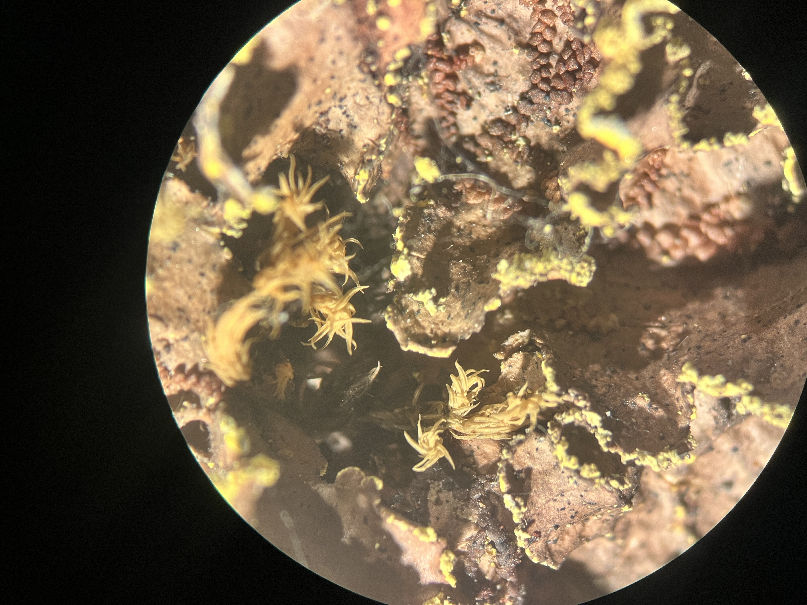

## Lichens

This summer, I've been working as a volunteer at the Botanical Research Institute of Texas (BRIT) located in Fort Worth, Texas--specifically with the herbarium. 

I was assigned the Heber W Youngken medicinal plant collection from the Massachusetts College of Pharmacy. This collection included vascular plants and lichens collected as early as 1868. I first worked primarily on transcribing and digitizing vascular plants, but Ashley (the collections manager) and I ended up finding a smaller collection of Youngken's lichens a few weeks in. Lichens and the symbiotic relationship behind their existence is incredibly interesting to me. 

Heber W Youngken was a plant collector who focused on medicinal plants. Most of the plants and lichens he personally collected were on the east coast, especially Maine, Massachusetts, and New Hampshire. There were also a few from California, North Carolina, and Florida. Some of the plant and lichen specimens in his collection were from other collections. These other collections had specimens collected by Maynard W. Quimby, M.E. Gutterson, John G. Jack, R.J. Clausen, and Arthur S. Pease. 

Imaging vascular plants is different from imaging lichens. Vascular plants are mounted on mounting paper, and they are kept in folders. You carefully move the mounted plant into the imaging station. You position the paper in the imaging station, and you snap a picture using the program. For lichens, we actually had to unmount a few off mounting paper. Lichens are not supposed to be mounted on paper. When imaging lichens, you get to position them yourself and make sure the label is in view.

This is what a imaging station looks like: (this one is not for lichens)

Here is a picture of Eupatorium purpuereur from the family Asteraceae in an imaging station:

Here are a few pictures of Sticta crocata from the family Lobariaceae:

References:  
https://web.uri.edu/youngken-garden/  
https://www.gbif.org/species/5477289/  
https://www.gbif.org/species/5401611/  

